# 💳 Real-time Transaction Fraud Detection & Analytics Pipeline

> A production-grade middleware system that detects credit card fraud **in real-time** using distributed stream processing, in-memory caching, and full-text search analytics — the same technologies used at Visa, Mastercard, and major payment processors.



---

## 📝 What Does This Project Do? (In Simple Terms)

Imagine you swipe your credit card at a store. Within **milliseconds**, this system:

1. **Receives** the transaction data (card number, amount, merchant, location)
2. **Checks** if your card is on a blocklist (stolen/compromised cards)
3. **Enriches** the data with merchant info and risk scores
4. **Analyzes** the transaction using 4 different fraud detection rules
5. **Alerts** if something looks suspicious (e.g., card used in 2 countries within 10 minutes)
6. **Stores** everything in a search engine so analysts can investigate

All of this happens in **under 2 seconds**, processing **100+ transactions per second**.

---

## 🎯 Why This Project? (For Visa Middleware Engineer Role)

This project demonstrates hands-on experience with the **exact technology stack** listed in the Visa Middleware Engineer job description:

| JD Requirement | How This Project Covers It |
|---|---|
| Hazelcast IMDG | 2-node cluster for hot card blocklist, merchant cache, Near Cache |
| Apache Flink | 4 fraud detection jobs in Java with windowing, CEP, watermarks |
| Apache Kafka | 5 topics, consumer groups, exactly-once semantics |
| ELK Stack | Elasticsearch + Logstash + Kibana for fraud analytics |
| Kubernetes | StatefulSets, HPA, NetworkPolicy, TLS secrets |
| Kerberos/SSL | TLS certificates, Kerberos JAAS config, NetworkPolicy |
| Java | Flink jobs written in Java 21 with Maven build |
| Terraform | Full AWS infrastructure (MSK, OpenSearch, ECS Fargate) |

---

## 🏗️ Project Structure (What's in Each Folder)

```
visa_project_middle_ware/
│
├── simulator/                    # 🔄 Generates fake credit card transactions
│   ├── transaction_generator.py  #    Python script that simulates ~100 txn/sec
│   ├── requirements.txt          #    Python dependencies (confluent-kafka)
│   └── Dockerfile                #    Docker image for the simulator
│
├── enrichment/                   # 🔍 Enriches transactions with risk data
│   ├── enrichment_service.py     #    Checks blocklist, adds risk score
│   ├── requirements.txt          #    Python deps (hazelcast-client, kafka)
│   └── Dockerfile                #    Docker image for enrichment service
│
├── hazelcast/                    # ⚡ In-memory cache configuration
│   └── hazelcast.yaml            #    Cluster config: blocklist, merchant cache
│
├── flink-jobs/                   # 🧠 Fraud detection brain (Java)
│   ├── pom.xml                   #    Maven build file with all dependencies
│   └── src/main/java/com/visa/fraud/
│       ├── jobs/
│       │   └── FraudDetectionPipeline.java  # 4 fraud detection jobs
│       ├── models/
│       │   └── Transaction.java             # Transaction data model
│       └── utils/
│           └── TransactionDeserializer.java # JSON parser for Kafka
│
├── elk/                          # 📊 Search & Analytics stack
│   ├── elasticsearch/
│   │   ├── index_templates.json  #    ES index mappings (how data is stored)
│   │   └── setup_indices.sh      #    Script to create indices + ILM policy
│   └── logstash/
│       └── pipeline/
│           └── logstash.conf     #    Kafka → ES pipeline with PCI masking
│
├── kafka/                        # 📨 Message broker topic setup
│   └── create_topics.sh          #    Creates 5 Kafka topics
│
├── k8s/                          # ☸️ Kubernetes deployment manifests
│   ├── namespace/
│   │   └── namespace.yaml        #    "middleware-fraud" namespace
│   ├── hazelcast/
│   │   └── hazelcast-statefulset.yaml  # 2-replica Hazelcast cluster
│   ├── kafka/
│   │   └── kafka-statefulset.yaml      # Zookeeper + 3-broker Kafka
│   ├── flink/
│   │   └── flink-deployment.yaml       # Flink + HPA (auto-scales 2→8)
│   ├── elk/
│   │   └── elk-stack.yaml              # ES + Logstash + Kibana
│   └── security/
│       └── tls-and-kerberos.yaml       # TLS certs, Kerberos, NetworkPolicy
│
├── terraform/                    # ☁️ AWS Infrastructure as Code
│   └── main.tf                   #    VPC, MSK, OpenSearch, ECS, ElastiCache
│
├── frontend/                     # 🖥️ Dashboard UI
│   └── index.html                #    Visa-branded fraud monitoring dashboard
│
├── docker-compose.yml            # 🐳 Run everything locally with one command
├── start.sh                      # ▶️ Start the pipeline (with health checks)
├── stop.sh                       # ⏹️ Stop the pipeline (graceful shutdown)
├── architecture_diagram.svg      # 📐 Animated architecture diagram
└── README.md                     # 📖 You're reading this!
```

---

## 🛠️ Technology Stack (Why Each Tool is Used)

### 1. Apache Kafka (Message Broker)
**What it does:** Acts as the "postal service" for data. Every transaction goes through Kafka before anything else processes it.

**Why we use it:**
- Can handle **millions of messages per second** without losing any
- Stores messages on disk so nothing is lost if a service crashes
- Multiple services can read the same data independently (pub/sub)
- Visa processes ~65,000 transactions per second — Kafka handles this scale

**Our setup:** 5 topics with 3-6 partitions each for parallel processing

### 2. Hazelcast IMDG (In-Memory Data Grid)
**What it does:** Super-fast cache that stores frequently accessed data **in RAM** instead of slow disk databases.

**Why we use it:**
- **Sub-5ms lookups** — checking if a card is stolen takes <5 milliseconds
- Distributed across multiple servers (no single point of failure)
- Near Cache pushes data to the client so network round-trips are avoided
- Used by Visa's actual middleware for real-time card blocklists

**Our setup:**
- `hot-card-blocklist` — Stolen/compromised card numbers (100K entries)
- `merchant-registry` — Store info for enrichment (LFU eviction)
- `velocity-counter` — Recent transaction counts per card (5-min TTL)

### 3. Apache Flink (Stream Processing Engine)
**What it does:** The "brain" that analyzes every transaction in real-time and decides if it's fraudulent.

**Why we use it:**
- Processes data **as it arrives** (not batch-style like Spark)
- Event-time processing with watermarks (handles late-arriving data)
- CEP (Complex Event Processing) for pattern matching
- Used by major banks and Visa for real-time fraud detection

**Our 4 Fraud Detection Jobs:**

| Job | Window Type | What It Detects |
|---|---|---|
| Velocity Check | Tumbling 60s | >5 transactions from same card in 1 minute |
| Geo-Hopping | CEP Pattern | Same card used in 2 countries within 10 minutes |
| Amount Anomaly | Sliding 1hr/5min | Transaction amount >3x the rolling average |
| Aggregation | Tumbling 5min | Country-level stats for compliance dashboards |

### 4. ELK Stack (Elasticsearch + Logstash + Kibana)
**What it does:** Collects, stores, and visualizes all transaction and fraud data.

**Components:**
- **Logstash** — Reads from Kafka, masks credit card numbers (PCI compliance), sends to Elasticsearch
- **Elasticsearch** — Stores and indexes all data for fast searching
- **Kibana** — Beautiful dashboards showing fraud trends, alerts, transaction volumes

**Why we use it:**
- Analysts need to search millions of transactions instantly
- Regulatory compliance requires transaction audit trails
- Real-time dashboards for fraud operations teams

### 5. Kubernetes (Container Orchestration)
**What it does:** Runs all our services as containers and manages them automatically.

**Why we use it:**
- Auto-restarts failed services
- HPA (Horizontal Pod Autoscaler) scales Flink workers from 2→8 pods under load
- StatefulSets for Kafka and Hazelcast (preserves data across restarts)
- NetworkPolicy restricts traffic between services (security)

### 6. Terraform (Infrastructure as Code)
**What it does:** Defines AWS cloud infrastructure in code so you can create/destroy it repeatably.

**Our AWS resources:**
- VPC with public/private subnets
- Amazon MSK (Managed Kafka with 3 brokers)
- Amazon OpenSearch (Managed Elasticsearch)
- Amazon ElastiCache (Managed Redis/Hazelcast alternative)
- ECS Fargate (Serverless containers)

---

## 🚀 How to Run (Step-by-Step)

### Prerequisites

You need these installed on your machine:
- **Docker** (v20+) — [Install Docker](https://docs.docker.com/get-docker/)
- **Docker Compose** (v2+) — Usually comes with Docker Desktop
- **8GB+ free RAM** — The full stack uses about 6-8GB

### Quick Start

```bash
# 1. Navigate to the project
cd /home/dom/AWS-WAGH-SESSIONS/aws-worked-projects/visa_project_middle_ware

# 2. Start everything (takes 2-3 minutes on first run)
./start.sh

# 3. Wait for all services to show "healthy" status
#    The script will show you all the URLs when ready

# 4. When done, stop everything
./stop.sh
```

### What Happens When You Run `./start.sh`

1. **Pre-flight checks** — Verifies Docker is running, ports are free, enough memory
2. **Builds Docker images** — Compiles simulator and enrichment service
3. **Starts infrastructure** — Zookeeper → Kafka → Hazelcast (in order)
4. **Starts ELK stack** — Elasticsearch → Logstash → Kibana
5. **Starts Flink** — JobManager → TaskManager
6. **Starts apps** — Enrichment service → Transaction simulator
7. **Health checks** — Verifies every service is responding
8. **Shows URLs** — Prints all dashboard/API links

---

## 🌐 Service URLs (After Starting)

| Service | URL | What You See |
|---|---|---|
| **Kibana** (Dashboards) | http://localhost:5601 | Fraud analytics, transaction trends |
| **Flink Web UI** | http://localhost:8081 | Running jobs, task managers, metrics |
| **Hazelcast Management Center** | http://localhost:8085 | Cache maps, cluster health, Near Cache |
| **Elasticsearch API** | http://localhost:9200 | Raw JSON API for querying data |
| **Kafka Broker** | localhost:9092 | Connect via Kafka CLI tools |
| **Logstash Monitoring** | http://localhost:9600 | Pipeline health and stats |

---

## 🧪 How to Test the Project

### Test 1: Watch Live Transactions Flowing

```bash
# See raw transactions as the simulator creates them
docker exec kafka kafka-console-consumer \
  --bootstrap-server localhost:9092 \
  --topic transactions.raw \
  --from-beginning | head -5
```

You'll see JSON like:
```json
{
  "transaction_id": "TXN-a1b2c3d4",
  "card_number": "****-****-****-4532",
  "amount": 156.99,
  "merchant": "Amazon",
  "country": "US",
  "timestamp": "2024-01-15T10:30:45Z"
}
```

### Test 2: Check Enriched Transactions

```bash
# Transactions after Hazelcast enrichment (with risk scores)
docker exec kafka kafka-console-consumer \
  --bootstrap-server localhost:9092 \
  --topic transactions.enriched | head -3
```

You'll see additional fields: `risk_score`, `merchant_category`, `geo_risk_level`

### Test 3: Watch Fraud Alerts

```bash
# See fraud detections from Flink (live feed)
docker exec kafka kafka-console-consumer \
  --bootstrap-server localhost:9092 \
  --topic transactions.alerts
# This will show new alerts as they arrive. Press Ctrl+C to stop watching.
```

Wait a few minutes — Flink needs 5+ transactions from the same card within 60 seconds to trigger velocity alerts.

### Test 4: Check Blocked Transactions

```bash
# Cards that were instantly blocked by Hazelcast
docker exec kafka kafka-console-consumer \
  --bootstrap-server localhost:9092 \
  --topic transactions.blocked
```

About 2% of simulated transactions use blocked card numbers.

### Test 5: Query Elasticsearch

```bash
# Count total transactions indexed
curl -s http://localhost:9200/visa-transactions-*/_count | python3 -m json.tool

# Search for high-amount transactions
curl -s "http://localhost:9200/visa-transactions-*/_search?q=amount:>5000&size=5" | python3 -m json.tool

# Get fraud alerts
curl -s http://localhost:9200/visa-fraud-alerts-*/_search | python3 -m json.tool

# Check index sizes
curl -s http://localhost:9200/_cat/indices?v
```

### Test 6: Inspect Hazelcast Cache

```bash
# Open Hazelcast Management Center in browser
# URL: http://localhost:8085
# Navigate to: Storage → Maps → hot-card-blocklist
# You'll see the blocked card entries with expiration times
```

### Test 7: Check Flink Job Status

```bash
# Open Flink UI in browser: http://localhost:8081
# You should see running jobs under "Running Jobs"
# Click on a job to see task managers, checkpoints, throughput
```

### Test 8: View Logstash Pipeline Health

```bash
# Check pipeline processing stats
curl -s http://localhost:9600/_node/stats/pipelines | python3 -m json.tool

# You'll see events_in, events_out, and filter stats showing PCI masking
```

---

## 🔐 Security Features

| Feature | Implementation | Why It's Important |
|---|---|---|
| **PCI-DSS Card Masking** | Logstash filter masks `4532-XXXX-XXXX-1234` → `****-****-****-1234` | Regulatory requirement — card numbers must never be stored in logs |
| **TLS/SSL** | K8s secrets with certificates for inter-service encryption | Prevents man-in-the-middle attacks on sensitive transaction data |
| **Kerberos Authentication** | JAAS config for Kafka broker authentication | Enterprise-grade authentication (used by Visa internally) |
| **Network Policy** | K8s NetworkPolicy restricts pod-to-pod traffic | Zero-trust networking — services can only talk to authorized peers |
| **VPC Isolation** | Terraform creates private subnets for data services | AWS best practice — databases never exposed to internet |

---

## 📊 Fraud Detection Scenarios (What Gets Caught)

### Scenario 1: Velocity Attack
> A stolen card is used 8 times in 1 minute at different gas stations
- **Detection:** Flink Velocity Check Job (tumbling 60s window)
- **Alert:** `VELOCITY_FRAUD: card ****4532 — 8 transactions in 60 seconds`
- **Response:** Alert sent to `transactions.alerts` topic

### Scenario 2: Geo-Hopping
> Same card buys groceries in New York, then 5 minutes later buys electronics in Moscow
- **Detection:** Flink CEP Pattern Matching Job
- **Alert:** `GEO_HOP_FRAUD: card ****7891 — US→RU within 5 minutes (impossible travel)`
- **Response:** Alert sent to `transactions.alerts` topic

### Scenario 3: Amount Anomaly
> A card that normally spends $50-200 suddenly has a $15,000 transaction
- **Detection:** Flink Amount Anomaly Job (sliding 1hr/5min window, >3x average)
- **Alert:** `AMOUNT_ANOMALY: card ****2345 — $15,000 vs avg $127 (118x normal)`
- **Response:** Alert sent to `transactions.alerts` topic

### Scenario 4: Blocklisted Card
> A known compromised card number attempts a transaction
- **Detection:** Hazelcast hot-card-blocklist lookup (<5ms)
- **Action:** Transaction immediately blocked — sent to `transactions.blocked`
- **Response:** No further processing needed — instant decline

---

## 🔧 Useful Commands Cheat Sheet

### Docker & Services
```bash
# Start everything
./start.sh

# Start without rebuilding images (faster)
./start.sh --skip-build

# Stop everything (keeps data)
./stop.sh

# Stop and delete all data (fresh start)
./stop.sh --clean

# Stop, delete data AND images (nuclear option)
./stop.sh --nuclear

# Check what's running
docker compose ps

# View logs for any service
docker logs -f visa-simulator      # Transaction generator
docker logs -f visa-enrichment     # Enrichment service
docker logs -f visa-kafka          # Kafka broker
docker logs -f visa-elasticsearch  # Elasticsearch
docker logs -f visa-flink-jm       # Flink JobManager
docker logs -f visa-flink-tm       # Flink TaskManager
docker logs -f visa-logstash       # Logstash pipeline
docker logs -f visa-kibana         # Kibana dashboard
```

### Kafka Commands
```bash
# List all topics
docker exec kafka kafka-topics --bootstrap-server localhost:9092 --list

# Describe a topic (partitions, replicas, configs)
docker exec kafka kafka-topics --bootstrap-server localhost:9092 \
  --describe --topic transactions.raw

# Count messages in a topic
docker exec kafka kafka-run-class kafka.tools.GetOffsetShell \
  --broker-list localhost:9092 --topic transactions.raw

# Consume from beginning
docker exec kafka kafka-console-consumer \
  --bootstrap-server localhost:9092 \
  --topic transactions.raw --from-beginning

# Consume only new messages (live tail)
docker exec kafka kafka-console-consumer \
  --bootstrap-server localhost:9092 \
  --topic transactions.alerts

# Check consumer group lag
docker exec kafka kafka-consumer-groups \
  --bootstrap-server localhost:9092 --describe --all-groups
```

### Elasticsearch Commands
```bash
# Cluster health
curl -s http://localhost:9200/_cluster/health | python3 -m json.tool

# List all indices
curl -s http://localhost:9200/_cat/indices?v

# Count documents in an index
curl -s http://localhost:9200/visa-transactions-*/_count

# Search transactions
curl -s "http://localhost:9200/visa-transactions-*/_search?size=5&pretty"

# Search fraud alerts
curl -s "http://localhost:9200/visa-fraud-alerts-*/_search?size=5&pretty"

# Get aggregation stats
curl -s "http://localhost:9200/visa-aggregations-*/_search?size=5&pretty"

# Delete an index (careful!)
curl -X DELETE "http://localhost:9200/visa-transactions-000001"
```

### Hazelcast Commands
```bash
# Management Center: http://localhost:8085
# Login → Storage → Maps → Select a map

# Check cluster status via REST
curl -s http://localhost:8085/rest/clusters

# View Hazelcast logs
docker logs visa-hazelcast-1
docker logs visa-hazelcast-2
```

### Flink Commands
```bash
# Flink Dashboard: http://localhost:8081
# Shows: Running Jobs, Task Managers, Job Details

# Check running jobs via REST API
curl -s http://localhost:8081/jobs | python3 -m json.tool

# Get job details
curl -s http://localhost:8081/jobs/overview | python3 -m json.tool

# Check task managers
curl -s http://localhost:8081/taskmanagers | python3 -m json.tool
```

### Kubernetes Commands (if deploying to K8s)
```bash
# Create the namespace
kubectl apply -f k8s/namespace/

# Deploy all services
kubectl apply -f k8s/hazelcast/
kubectl apply -f k8s/kafka/
kubectl apply -f k8s/flink/
kubectl apply -f k8s/elk/
kubectl apply -f k8s/security/

# Check pod status
kubectl get pods -n middleware-fraud

# Check services
kubectl get svc -n middleware-fraud

# View pod logs
kubectl logs -f <pod-name> -n middleware-fraud

# Check HPA status (Flink auto-scaling)
kubectl get hpa -n middleware-fraud

# Check network policies
kubectl get networkpolicy -n middleware-fraud
```

### Terraform Commands (if deploying to AWS)
```bash
cd terraform/

# Initialize Terraform
terraform init

# Preview what will be created
terraform plan

# Deploy to AWS (costs money!)
terraform apply

# See deployed resource details
terraform output

# Destroy everything
terraform destroy
```

---

## 🔄 Data Flow (How Transactions Move Through the System)

```
Credit Card Swipe
       │
       ▼
┌─────────────────┐
│  SIMULATOR       │  (Python) Generates fake card transactions
│  ~100 txn/sec    │  with normal, suspicious, and blocked patterns
└────────┬────────┘
         │ Kafka Producer
         ▼
┌─────────────────┐
│  KAFKA TOPIC     │  transactions.raw (6 partitions)
│  transactions.raw│  Stores every transaction for downstream
└────────┬────────┘
         │ Kafka Consumer
         ▼
┌─────────────────┐        ┌─────────────────┐
│  ENRICHMENT SVC  │◄──────►│  HAZELCAST       │
│  (Python)        │ lookup │  hot-card-blocklist│
│  Risk scoring    │        │  merchant-registry │
│  Geo risk check  │        │  velocity-counter  │
└────────┬────────┘        └─────────────────┘
         │
    ┌────┴────┐
    │         │
    ▼         ▼
┌────────┐ ┌────────┐
│ENRICHED│ │BLOCKED │  If card is on blocklist → instant decline
│ topic  │ │ topic  │
└───┬────┘ └────────┘
    │
    ├──────────────────────────┐
    │  Kafka Consumer          │  Kafka Consumer (all topics)
    ▼                          ▼
┌─────────────────┐   ┌─────────────────┐
│  APACHE FLINK    │   │  LOGSTASH        │
│  4 Fraud Jobs:   │   │  PCI card masking│
│  • Velocity      │   │  Geo-point create│
│  • Geo-hopping   │   │  Route to indices│
│  • Amount anomaly│   └────────┬────────┘
│  • Aggregation   │            │
└────────┬────────┘            ▼
         │              ┌─────────────────┐
         │              │  ELASTICSEARCH   │
         │              │  3 indices:      │
         │              │  • transactions  │
         ▼              │  • fraud-alerts  │
┌─────────────────┐    │  • aggregations  │
│  KAFKA TOPICS    │    └────────┬────────┘
│  • txn.alerts    │             │
│  • txn.aggregated│             ▼
└─────────────────┘    ┌─────────────────┐
                       │  KIBANA          │
                       │  Fraud Dashboard │
                       │  Analytics &     │
                       │  Visualizations  │
                       └─────────────────┘
```

---

## ❓ FAQ

**Q: Does this actually connect to Visa's systems?**
A: No. This is a self-contained demo that simulates the same architecture and patterns used by payment processors. All data is fake.

**Q: How much does it cost to run?**
A: $0 locally. The Docker Compose setup runs entirely on your machine. The Terraform/AWS resources are provided as reference but not deployed by default.

**Q: Why Java for Flink and Python for everything else?**
A: Flink's best performance and features are in Java (CEP library, type safety, watermarks). Python is used for the simulator and enrichment because they're I/O-bound tasks where Python's simplicity helps.

**Q: Can I add more fraud detection rules?**
A: Yes! Add new jobs to `FraudDetectionPipeline.java`. Flink's windowing and CEP patterns make it easy to add new detection logic.

**Q: How do I add more blocked cards to the Hazelcast blocklist?**
A: The enrichment service pre-loads sample cards. For production, you'd connect to a card database. For demo, edit the `BLOCKED_CARDS` set in `enrichment_service.py`.

---

## 📚 Learning Resources

- [Apache Kafka Documentation](https://kafka.apache.org/documentation/)
- [Hazelcast IMDG Reference Manual](https://docs.hazelcast.com/imdg/latest/)
- [Apache Flink Documentation](https://flink.apache.org/docs/stable/)
- [Elastic Stack Guide](https://www.elastic.co/guide/index.html)
- [Kubernetes Documentation](https://kubernetes.io/docs/)
- [Terraform AWS Provider](https://registry.terraform.io/providers/hashicorp/aws/latest/docs)

---

## 🧑‍💻 Author

Built as a portfolio project demonstrating Visa Middleware Engineering capabilities.

**Technologies:** Kafka • Hazelcast • Flink • ELK • Kubernetes • Terraform • Docker • Java • Python
